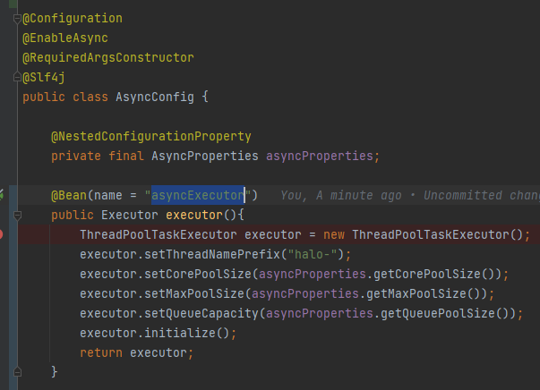
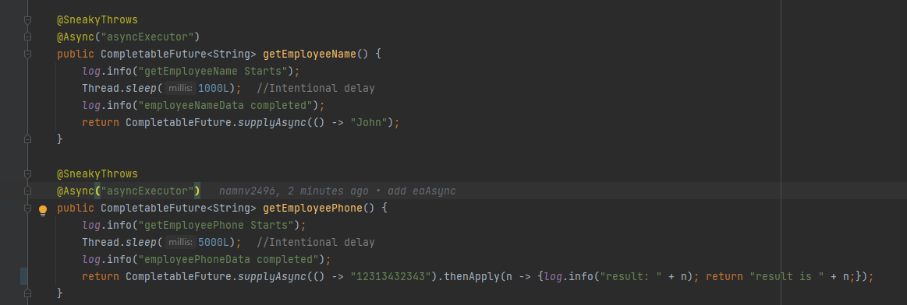
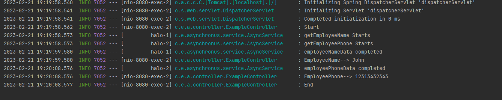
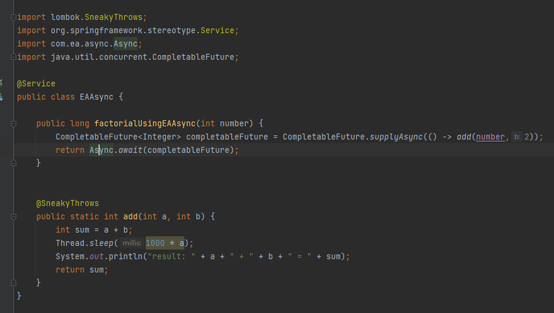
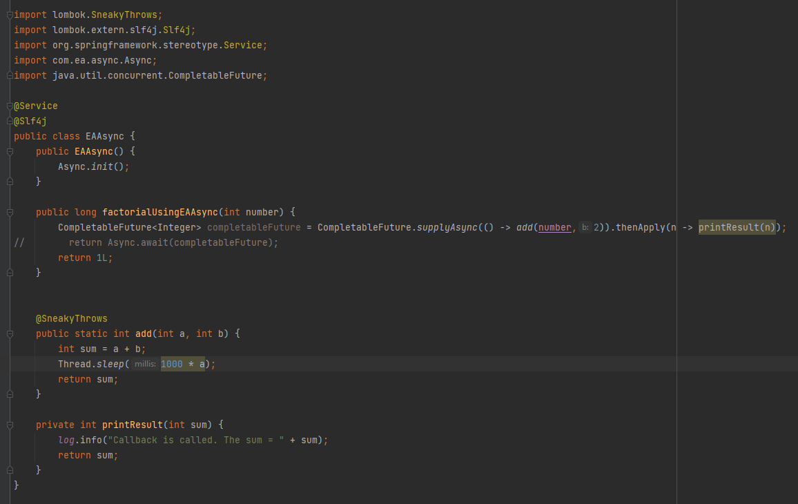
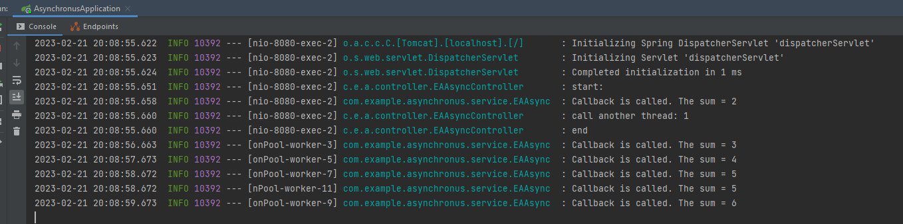

# asynchronous

## Enable async config

`@EnableAsync`

create a bean with special name: `asyncExecutor`

with data:

Call async custom config by:

    GET http://localhost:8080/test2 

# Use EAAsync

to run with async and handle the return value. We use `thenApply()`

    GET http://localhost:8080/eaAsync

Ref: https://viblo.asia/p/lap-trinh-da-luong-voi-completablefuture-trong-java-8-6J3ZgBMLKmB